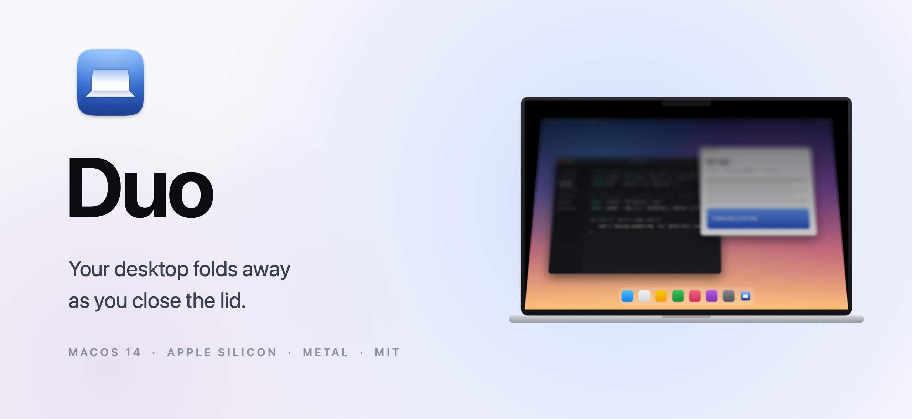
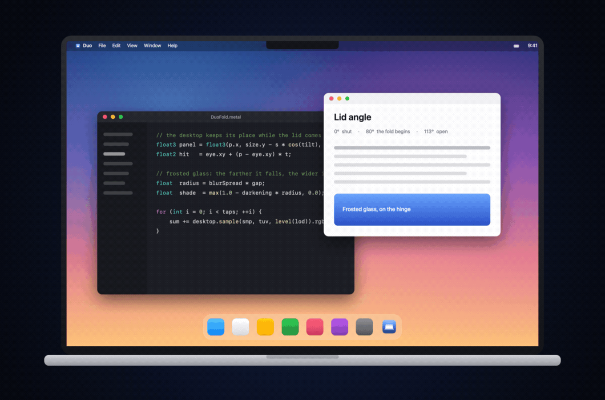
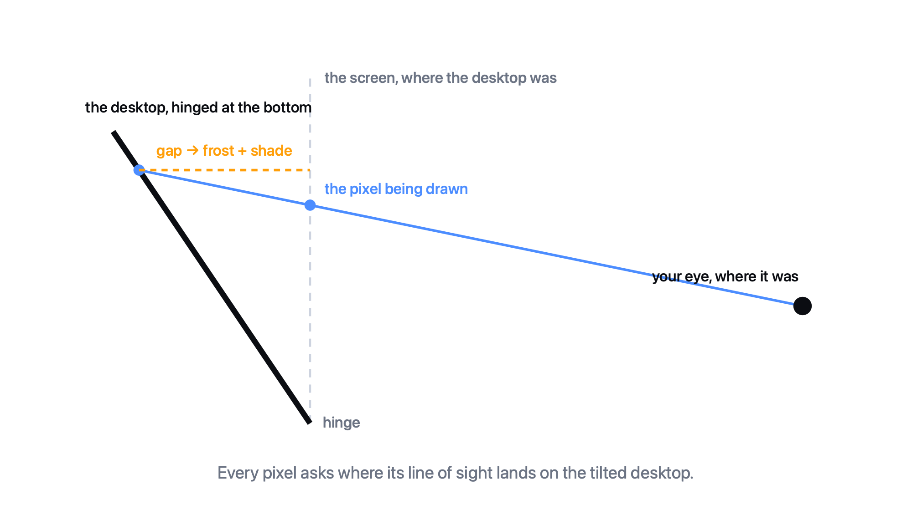

<p align="center">
  <picture>
    <source media="(prefers-color-scheme: dark)" srcset="docs/hero-dark.png">
    
  </picture>
</p>

<p align="center">
  <a href="#install"><b>Install</b></a> &nbsp;·&nbsp;
  <a href="#how-it-works"><b>How it works</b></a> &nbsp;·&nbsp;
  <a href="#settings"><b>Settings</b></a> &nbsp;·&nbsp;
  <a href="#build-from-source"><b>Build</b></a> &nbsp;·&nbsp;
  <a href="https://github.com/fx-xf/duo/releases/latest"><b>Download&nbsp;→</b></a>
</p>

<p align="center">
  
</p>

<p align="center">
  <sub>Every frame above was rendered by Duo's own Metal shader. No mockups.</sub>
</p>

<br>

## The idea

Close a MacBook and the lid moves. The picture on it doesn't have to.

Duo pins your desktop to the plane it was sitting on and then draws what you would
actually see through the glass as the panel tilts away from you: the desktop settles
downward, frosts over, dims — and snaps back the moment you open up. It follows the
hinge one degree at a time, read straight from the Mac's own sensor.

<br>

## How it works

<p align="center">
  <picture>
    <source media="(prefers-color-scheme: dark)" srcset="docs/geometry-dark.png">
    
  </picture>
</p>

| | |
|---|---|
| **The hinge** | An Apple silicon MacBook reports its lid angle over HID. Duo reads that sensor directly — no polling loops, no accessibility hacks. |
| **The desktop** | ScreenCaptureKit hands over the live screen. The overlay window hides itself from capture, so Duo never films itself. |
| **The fold** | For every pixel, a ray leaves your eye, passes through the screen and lands on the tilted desktop. That point is what the pixel shows. |
| **The frost** | The farther the desktop has fallen behind the glass, the wider each sample scatters and the more light it swallows. Rays that miss it come back black. |
| **The finish** | The panel keeps the display's own rounded top corners, and at zero tilt the overlay is pixel-for-pixel the desktop underneath — so the effect begins and ends invisibly. |

<br>

## Install

1. Download the latest build from [**Releases**](https://github.com/fx-xf/duo/releases/latest), unzip it and drag **Duo** into Applications.
2. macOS will refuse to open it the first time — the app is signed ad-hoc, not notarised. Open **System Settings → Privacy & Security**, scroll down and choose **Open Anyway**.
3. Allow **Screen Recording** when Duo asks, then **Quit & Reopen**. Without it Duo has nothing to fold.
4. Duo lives in the menu bar. Close the lid past 80° and watch.

> Prefer to build it yourself? [Jump down](#build-from-source) — a locally built copy skips the Gatekeeper detour entirely.

<br>

## Requirements

| | |
|---|---|
| **macOS** | 14 Sonoma or later |
| **Mac** | An Apple silicon MacBook with a lid angle sensor. The M1 Air and the 13″ Touch Bar Pro don't have one; on a Mac without it, Duo runs on the manual angle slider. |
| **Permission** | Screen Recording, so the desktop can be captured |

**Private by design.** Frames are processed on your Mac, on the GPU, and never written anywhere. Duo has no account, no network code and nothing to phone home to.

<br>

## Settings

| Setting | Default | What it does |
|---|---|---|
| **Starts below** | 80° | Above this hinge angle nothing happens, however you move the lid. Below it, the glass tilts with the hinge. |
| **Perspective** | 100% | Where you sit. 100% puts your eye half a metre from the screen; less reads as sitting farther back. |
| **Variable blur** | 65% | How quickly frost grows with the gap. |
| **Shadow** | 35% | How quickly light is lost. |
| **Style** | Silk | Presets over the three sliders above: **Silk**, **Shade**, **Frost**. |
| **Follow lid** | on | Off hands the angle to a slider, which is the easiest way to see the effect without touching the lid. |
| **Click when the lid opens** | on | A soft synthesised click when the desktop clears. |

<br>

## Build from source

```bash
git clone https://github.com/fx-xf/duo.git
cd duo
./build.sh
```

That builds `Duo.app` and installs it into `/Applications`. All it needs is the Command
Line Tools — no Xcode, because the Metal shader is compiled at launch rather than ahead
of time.

```bash
xcode-select --install   # if `swift build` isn't there yet
```

<br>

## Under the hood

| File | |
|---|---|
| [`Sources/Duo/LidAngleSensor.swift`](Sources/Duo/LidAngleSensor.swift) | The hinge angle, straight off the HID sensor |
| [`Sources/Duo/LidModel.swift`](Sources/Duo/LidModel.swift) | Angle in, glass tilt out: threshold, spring, snap back |
| [`Sources/Duo/DesktopCapture.swift`](Sources/Duo/DesktopCapture.swift) | The live desktop, through ScreenCaptureKit |
| [`Sources/Duo/Shaders.swift`](Sources/Duo/Shaders.swift) | The fold itself, in Metal Shading Language |
| [`Sources/Duo/BendRenderer.swift`](Sources/Duo/BendRenderer.swift) | Pipeline, mip chain, uniforms |
| [`Sources/Duo/OverlayController.swift`](Sources/Duo/OverlayController.swift) | The click-through window it all lands in |
| [`Sources/Duo/BendEngine.swift`](Sources/Duo/BendEngine.swift) | Sensor, capture and overlay, tied together |
| [`Tools/make-readme-art.swift`](Tools/make-readme-art.swift) | Renders every picture in this README |

<br>

## Credits

The frosted-glass fold comes from [**DuoLikeAnimation**](https://github.com/elijah-semyonov/DuoLikeAnimation)
by Elijah Semyonov (MIT) — a phone tilting in the hand, here turned on its side for a
laptop lid on its hinge. See [THIRD-PARTY-NOTICES.md](THIRD-PARTY-NOTICES.md).

<br>

## Licence

MIT — see [LICENSE](LICENSE).

Not affiliated with Apple. Mac, MacBook and macOS are trademarks of Apple Inc.
